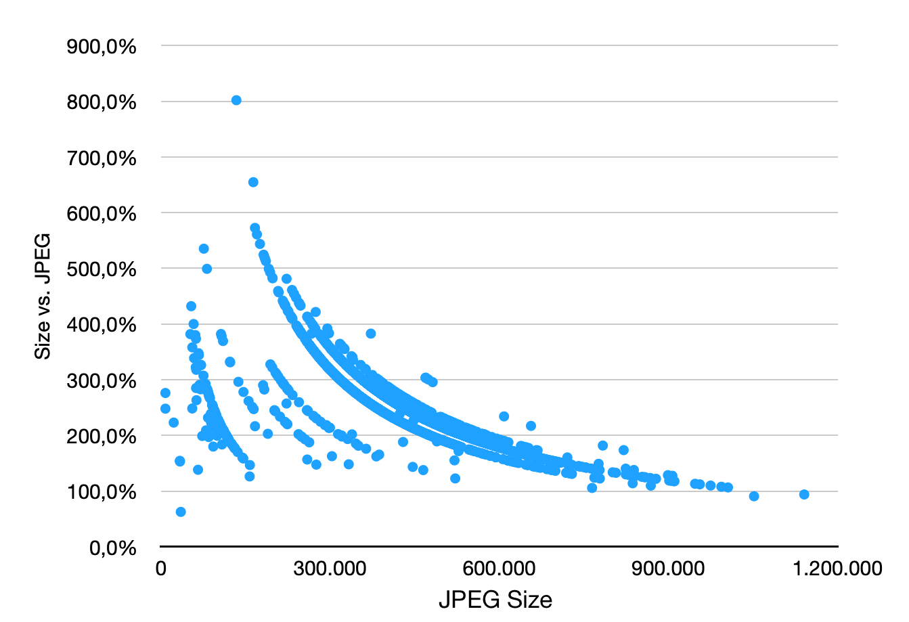
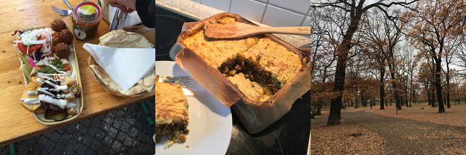
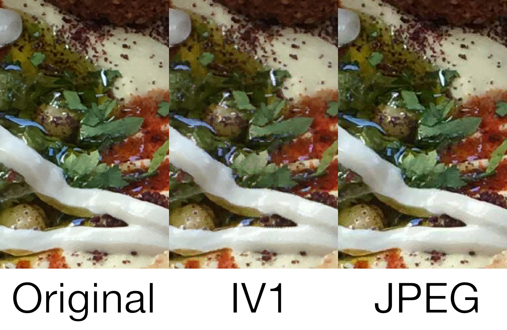
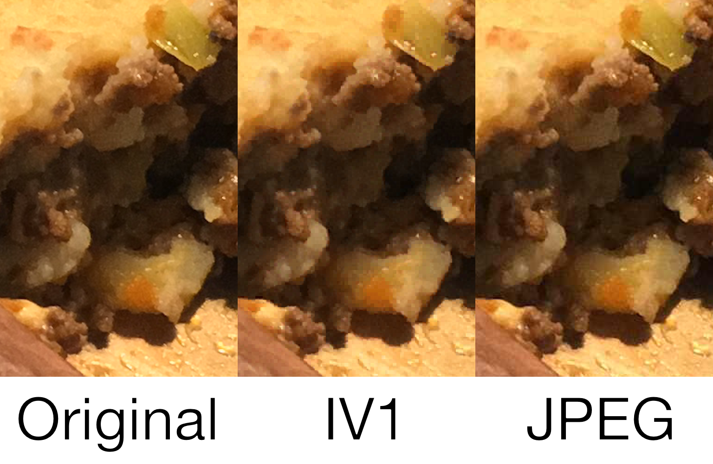
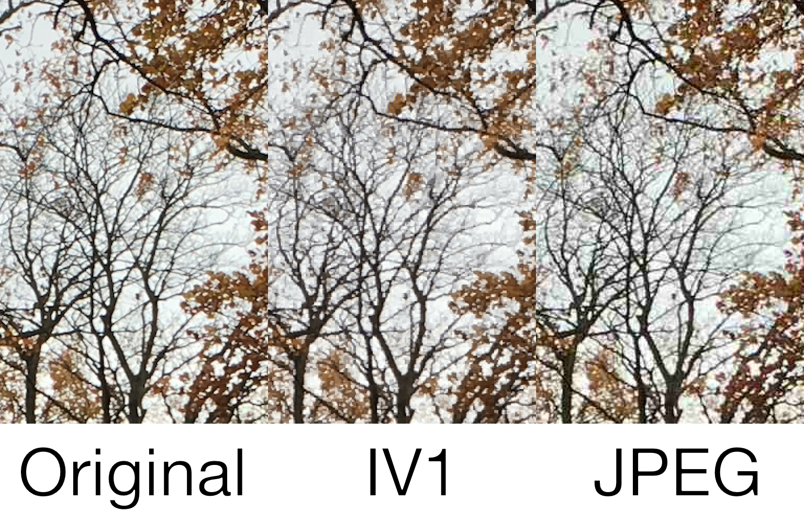

# IV1 - A Vector Quantization-based Image Compression Codec

**IV1** (pronounced "ivy-one") is an extremely low complexity, fixed-ratio, lossy image codec. It's not made to be best-in-class in terms of image quality, nor compression ratios, but rather be a simple way to compress lossy images that's very computationally cheap to decode; it actually doesn't even require any multiplication instructions to do so.
On the other hand, the encoding process is very CPU/arithmetically taxing, though the code is structured in such a way that it's very easy for compilers to vectorize - all characteristics inherited from the C++ implementation of [VQLib](https://github.com/MVittiS/VQLib).

## How well does it compress?

IV1 is surprisingly not too far behind JPEG in terms of compression ratio for a given fixed image quality, however - it can range from 6x the size of an equivalent JPEG image (with little high-frequency detail) to, in very rare scenarios, beating JPEG (for images with lots of high-frequency detail, or corrupted by camera sensor noise).

Here are the results against a personal 2000 high resolution image corpus (with pictures mostly in the 12-megapixel range, and some lower-resolution ones thrown in as well as computer screenshots). The comparison method was to compress a .png image with IV1, then use a script to perform a binary search on the space of JPEG's Q(uality) setting using [DSSIM](https://github.com/kornelski/dssim) and [ImageMagick](http://imagemagick.org), looking for the JPEG with the closest matching DSSIM.

## Samples

Here are some examples where, for the JPEG with the closest DSSIM, IV1 performs (subjectively on the author's eyes) worse, equally, and better than JPEG.

## Technical Details

The codec is made of a simple 2-step VQ structure - the base image is broken down into 4x4 tiles, the average color for these tiles is computed, and all of these tile average colors go through a 256-color quantizer. We then subtract the final quantized color from all the ones in a tile; finally, the residuals of these tiles (4x4 RGB triplets) are themselves VQ-compressed. All compression and decompression is done in RGB space with no color space conversion or downsampling, though it has been empirically observed that weighting the input pixels prior to quantization with the Rec.709 values yields slighly better results (and unsurprisingly, a slighly higher SSIM score).

The size of compressed images is fixed, since both VQ dictionaries are always 256 elements in size, and only depend on the input image dimensions. The formula is `12 [file header] + 256 * (3 [first dictionary] + 48 [second dictionary]) + 2 * ceil(image width / 4) * ceil(image height / 4)`, in bytes; this means that the compression ratio increases assymptotically as the image size increases, up to a theoretical maximum of 24:1 (or 2 bytes per 4x4 tile of RGB pixels, 48 bytes in size). Of course, this also means that the larger the image, the worse is IV1's ability to capture fine image detail. Some examples below:

| Dimensions     | # of pixels |   IV1 Size   | Compression Ratio |
| -------------- |:-----------:|:------------:|:-----------------:|
|    320x240     |    76.8k    |    22.1KiB   |     ~10.2:1       |
|    640x480     |     307k    |    50.3KiB   |     ~17.9:1       |
|    960x640     |     614k    |    87.8KiB   |     ~20.5:1       |
|   1280x960     |    1.22m    |    163KiB    |     ~22.1:1       |
|   1920x1080    |    2.07m    |    266KiB    |     ~22.8:1       |
|   2560x1920    |    4.91m    |    613KiB    |     ~23.5:1       |
|   3840x2160    |    8.29m    |    1.00MiB   |     ~23.7:1       |
|   5120x3840    |    19.6m    |    2.36MiB   |     ~23.7:1       |
